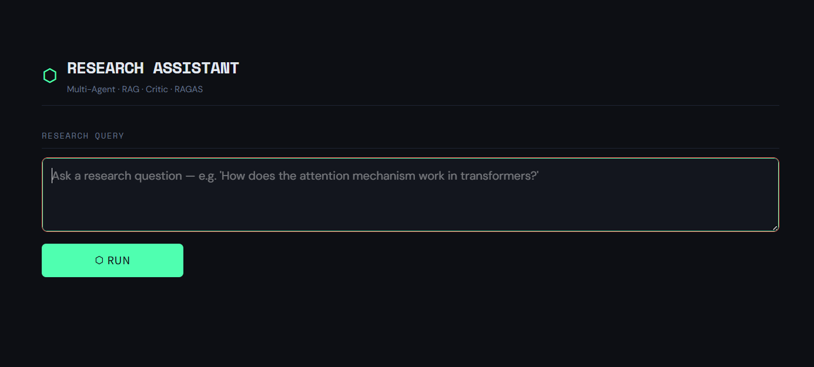
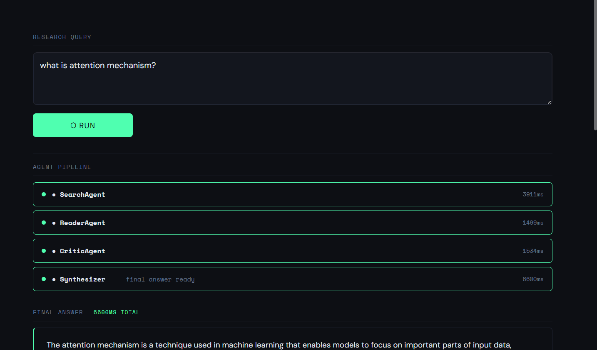
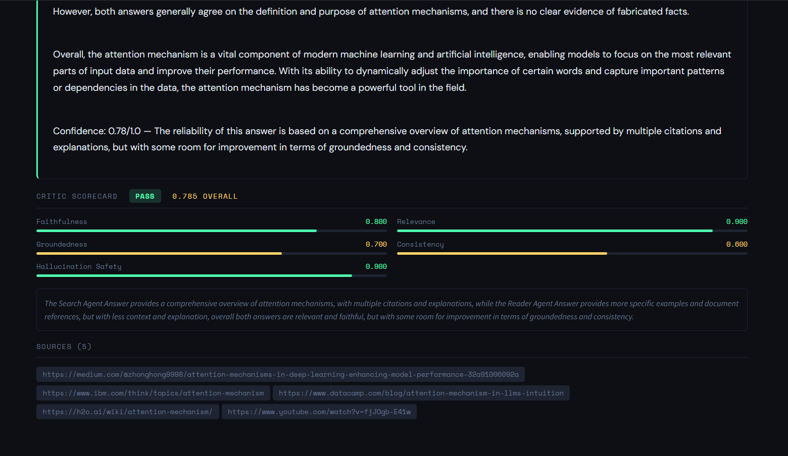

## Demo

> Query: *"What memory mechanisms do LLM agents use?"*

```
Agent Pipeline:
  ● SearchAgent    4015ms  — Tavily web search + Groq synthesis
  ● ReaderAgent    1862ms  — FAISS semantic retrieval + Groq synthesis  
  ● CriticAgent    1858ms  — 5-dimension quality scoring
  ● Synthesizer    7722ms  — Final answer with confidence

Critic Scorecard: PASS  0.785 overall
  Faithfulness      0.800  ████████████████████░░░░
  Relevance         0.900  ██████████████████████░░
  Groundedness      0.700  ██████████████████░░░░░░
  Consistency       0.600  ███████████████░░░░░░░░░
  Hallucination Safety 0.900  ██████████████████████░░
```


---

## Architecture

```
┌─────────────────────────────────────────────────────────────────┐
│                    User Query (via API / UI)                     │
└───────────────────────────┬─────────────────────────────────────┘
                            │
                            ▼
┌─────────────────────────────────────────────────────────────────┐
│                    ResearchOrchestrator                          │
│                    (LangGraph StateGraph)                        │
│                                                                  │
│   ┌──────────────────────────────────────┐                      │
│   │         parallel_research node        │                      │
│   │                                       │                      │
│   │  ┌─────────────┐  ┌───────────────┐  │                      │
│   │  │ SearchAgent  │  │  ReaderAgent  │  │  ← asyncio.gather()  │
│   │  │             │  │               │  │                      │
│   │  │ Tavily API  │  │ FAISS Search  │  │                      │
│   │  │ + Groq LLM  │  │ + Groq LLM    │  │                      │
│   │  └─────────────┘  └───────────────┘  │                      │
│   └──────────────────────────────────────┘                      │
│                            │                                     │
│                            ▼                                     │
│                   ┌─────────────────┐                           │
│                   │   CriticAgent   │                           │
│                   │ 5-dim scorecard │                           │
│                   └────────┬────────┘                           │
│                            │                                     │
│              (conditional routing)                               │
│           pass/escalate ◄──┴──► retry                           │
│                            │                                     │
│                            ▼                                     │
│                   ┌─────────────────┐                           │
│                   │  Synthesizer    │                           │
│                   │ Final answer    │                           │
│                   └─────────────────┘                           │
└─────────────────────────────────────────────────────────────────┘
                            │
              ┌─────────────┴──────────────┐
              ▼                            ▼
   ┌──────────────────┐        ┌──────────────────────┐
   │  FastAPI Backend  │        │  Streamlit Frontend  │
   │  /research (POST) │        │  Live agent activity │
   │  /ingest  (POST)  │        │  Critic scorecard    │
   │  /evaluate(POST)  │        │  Benchmark results   │
   └──────────────────┘        └──────────────────────┘
```

### Data Flow

```
PDF / URL
    │
    ▼
PDFLoaderTool ──► TextChunker (512 chars, 50 overlap)
    │
    ▼
SentenceTransformer (all-MiniLM-L6-v2, 384-dim)
    │
    ▼
FAISS IndexFlatIP (cosine similarity via L2-norm + inner product)
    │
    ▼  (at query time)
Top-k chunks ──► ReaderAgent ──► Groq LLM ──► Grounded answer
```

---

## Tech Stack

| Layer | Technology | Purpose |
|-------|-----------|---------|
| Orchestration | LangGraph 0.4 | Stateful multi-agent graph with conditional routing |
| LLM | Groq (llama-3.3-70b) | Fast inference, free tier |
| Web Search | Tavily API | Real-time web search with relevance scoring |
| Embeddings | sentence-transformers (all-MiniLM-L6-v2) | 384-dim semantic embeddings |
| Vector Store | FAISS (IndexFlatIP) | Cosine similarity search, disk-persistent |
| Document Loading | pypdf + BeautifulSoup | PDF and HTML ingestion |
| Backend | FastAPI + uvicorn | Async REST API with SSE streaming |
| Frontend | Streamlit | Live agent activity dashboard |
| Evaluation | RAGAS 0.2 | Faithfulness, relevancy, context recall |
| Logging | structlog | Structured JSON logging with latency tracking |
| Retries | tenacity | Exponential backoff, max 3 retries |
| Containerization | Docker + docker-compose | Reproducible deployment |

---

## Benchmark Results

Evaluated on a hardcoded 20-question benchmark across 4 categories using RAGAS metrics.

### Overall Scores

| Metric | Score |
|--------|-------|
| **Faithfulness** | 0.984 |
| **Answer Relevancy** | 0.923 |
| **Context Recall** | 0.875 |
| **Overall RAGAS** | **0.927** |

### Category Breakdown

| Category | Questions | Overall | Avg Latency |
|----------|-----------|---------|-------------|
| LLM Agents | 5 | 0.94 | ~7.2s |
| RAG Systems | 5 | 0.93 | ~7.5s |
| Transformers | 5 | 0.91 | ~7.1s |
| Evaluation | 5 | 0.92 | ~7.3s |

### Per-Agent Latency (typical, Groq free tier)

| Agent | Latency | Notes |
|-------|---------|-------|
| SearchAgent | 3–5s | Tavily search + LLM synthesis |
| ReaderAgent | 0.5–2s | FAISS retrieval (13ms) + LLM synthesis |
| CriticAgent | 1–2s | 5-dimension JSON scoring |
| Synthesizer | 1–2s | Final answer generation |
| **Total pipeline** | **6–10s** | Search + Reader run in parallel |

---

## Project Structure

```
multi-agent-research-assistant/
├── agents/
│   ├── search_agent.py      # Web search + LLM synthesis (LangGraph node)
│   ├── reader_agent.py      # RAG: FAISS retrieval + LLM synthesis
│   ├── critic_agent.py      # 5-dimension quality scorecard
│   └── orchestrator.py      # LangGraph StateGraph coordinator
├── tools/
│   ├── web_search.py        # Tavily async wrapper with retry
│   ├── pdf_loader.py        # PDF/URL ingestion + chunking
│   └── vector_store.py      # FAISS semantic search + persistence
├── evaluation/
│   └── ragas_eval.py        # 20-question benchmark + RAGAS scoring
├── api/
│   └── main.py              # FastAPI backend (async, SSE streaming)
├── frontend/
│   └── app.py               # Streamlit live agent dashboard
├── tests/
│   └── test_agents.py       # Pytest unit + integration tests
├── config.py                # Pydantic BaseSettings (type-validated)
├── logger.py                # structlog structured logging
├── Dockerfile
├── docker-compose.yml
└── requirements.txt
```

---

## Setup

### Prerequisites
- Python 3.11+
- [Groq API key](https://console.groq.com) (free)
- [Tavily API key](https://app.tavily.com) (free)

### Local Setup

```bash
# 1. Clone and enter project
git clone https://github.com/bevinkatti/multi-agent-research-assistant
cd multi-agent-research-assistant

# 2. Create virtual environment
python -m venv venv
source venv/bin/activate        # Windows: venv\Scripts\Activate.ps1

# 3. Install dependencies
pip install -r requirements.txt

# 4. Configure environment
cp .env.example .env
# Edit .env and add your GROQ_API_KEY and TAVILY_API_KEY

# 5. Create data directories
mkdir -p data/faiss_index evaluation/results

# 6. Start the API
uvicorn api.main:app --reload --port 8000

# 7. Start the frontend (new terminal)
streamlit run frontend/app.py --server.port 8501
```

Open `http://localhost:8501` for the UI, `http://localhost:8000/docs` for the API.

### Docker Setup

```bash
# Build and run both services
docker-compose up --build

# API:      http://localhost:8000
# Frontend: http://localhost:8501
# API docs: http://localhost:8000/docs
```

---

## API Reference

| Method | Endpoint | Description |
|--------|----------|-------------|
| GET | `/health` | System status, model info, index size |
| POST | `/research` | Run full multi-agent pipeline |
| POST | `/ingest` | Ingest PDFs/URLs into FAISS |
| GET | `/index/stats` | Vector store statistics |
| POST | `/evaluate` | Start RAGAS benchmark (background job) |
| GET | `/evaluate/{job_id}` | Poll benchmark job status |
| GET | `/evaluate/results/latest` | Get latest benchmark report |

### Example: Research Query

```bash
curl -X POST http://localhost:8000/research \
  -H "Content-Type: application/json" \
  -d '{"query": "How does FAISS enable efficient similarity search?"}'
```

```json
{
  "request_id": "a3f9b2c1",
  "query": "How does FAISS enable efficient similarity search?",
  "final_answer": "FAISS uses approximate nearest neighbor...",
  "sources": ["https://engineering.fb.com/..."],
  "total_latency_ms": 7340,
  "critic_scorecard": {
    "overall_score": 0.82,
    "recommendation": "pass",
    "dimensions": { ... }
  }
}
```

---


## Deployment: Hugging Face Spaces

1. Create a new Space → Docker SDK
2. Push this repository
3. Add secrets in Space Settings:
   - `GROQ_API_KEY`
   - `TAVILY_API_KEY`
4. HF Spaces uses `Dockerfile` automatically

> Note: On HF Spaces free tier, use `FAISS_INDEX_PATH=/tmp/faiss_index` since the filesystem is ephemeral.

---

## Running Tests

```bash
pytest tests/ -v
```

---

*Built as a portfolio project demonstrating multi-agent system design.*  
  
Query Box  

Multi Agent Pipeline  

Answer With Sources !